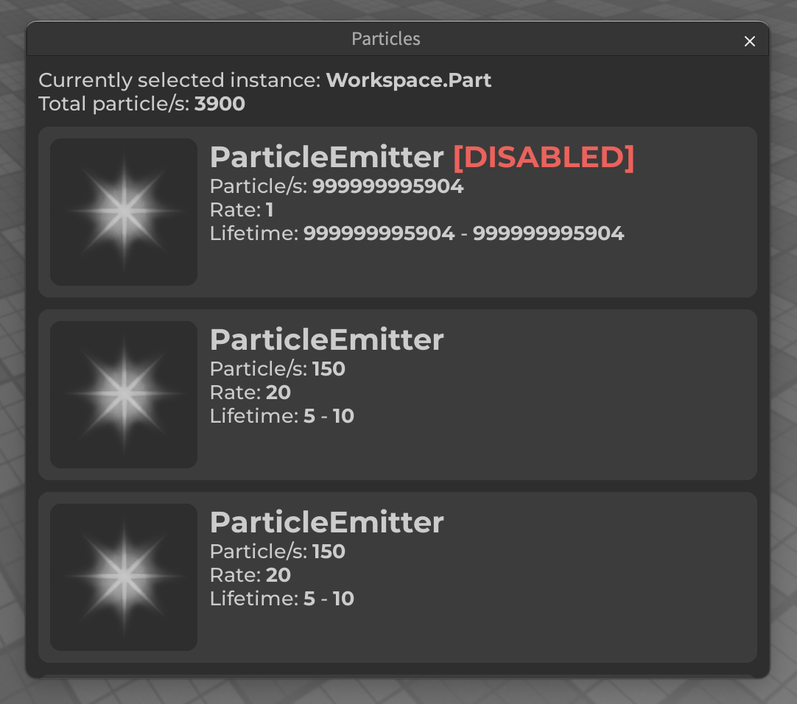

# Particles

  

A fairly simple plugin that I made in a day! Pretty much shows you all of the particles under a instance that you have select, and is sorted by how much it emits per second. This is a plugin thats mainly for [REx Reincarnated](https://www.roblox.com/games/8549934015/SUMMER-PT-1-REx-Reincarnated)

# How to use

Just select an instance, and the plugin will show you all of the particles under it! You can then click on that to go to the particle emitter and be able to make any fixes that are needed to optimize it!
